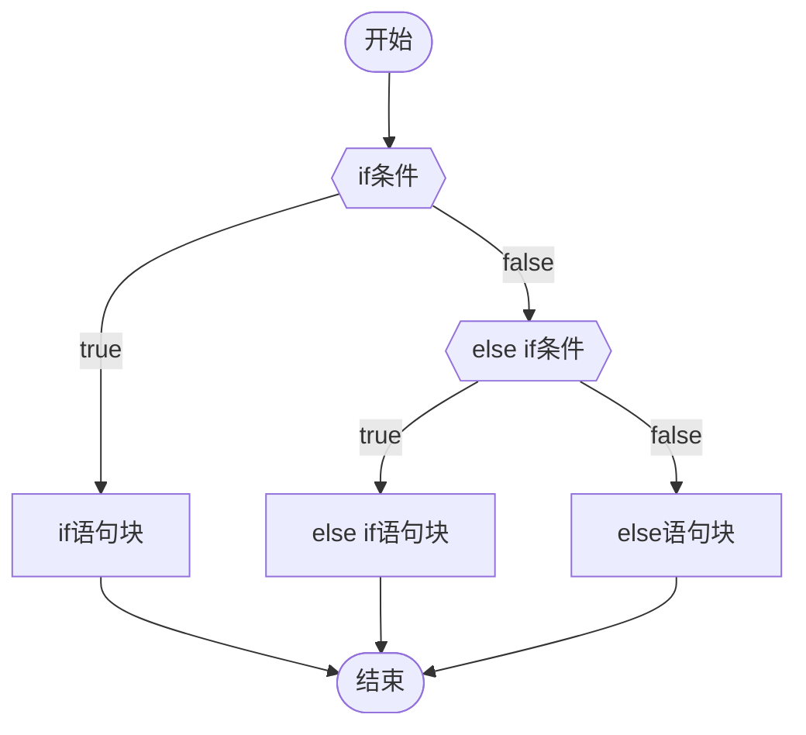

---

## 1.1 字体格式测试

|   显示效果    |      写法       | 备注 |
|:-------------:|:---------------:|:----:|
|  ~~删除线~~   |  `~~删除线~~`   |      |
|   ==高亮==    |   `==高亮==`    |      |
|    *斜体*     |    `*斜体*`     |      |
|   **粗体**    |   `**粗体**`    |      |
| <u>下划线</u> | `<u>下划线</u>` |      |

```ad-warning
title:注意下面的部分语法，Obsidian的Markdown编辑器并不支持这种写法
```

|       显示效果       |      写法       |          备注          |
|:--------------------:|:---------------:|:----------------------:|
|     4 的平方 4^2^      |     `4^2^`      | Obsidian 不支持此种写法 |
| 4 的平方 4<sup>2</sup> | `4<sup>2</sup>` |                        |
|       下标 a~1~       |     `a~1~`      | Obsidian 不支持此种写法 |
|  下标 a<sub>1</sub>   | `a<sub>1</sub>` |                        |

## 1.2 代码块测试

```ad-note
title:这是一段C语言代码
~~~C
#include <stdio.h>

int main(void)
{
	printf("Hello, world!!!\n");

	return 0;
}
~~~
```

`````ad-note
title: 笔记（嵌套提示演示，信息折叠状态为：常开，点击此标题栏可以折叠信息）
collapse: open

这是一个测试信息栏01。

````ad-tip
title: 提示

这是一个测试信息栏02。

```ad-warning
title: 警告（信息折叠状态为：常闭，点击此标题栏可以打开信息）
collapse: close

这是一个测试信息栏03。

```

````

这是一个测试信息栏04。

`````

````ad-info

```ad-bug
title: I'm Nested!
~~~javascript
throw new Error("Oops, I'm a bug.");
~~~
```

```C
#include <stdio.h>

int main(void)
{
	printf("Hello, world!!!\n");

	return 0;
}
```

````

## 1.3 无序列表和有序列表

- 无序列表 01
- 无序列表 02
- 无序列表 03
1. 有序列表 01
2. 有序列表 02
3. 有序列表 03

```ad-danger
title:123

这是一个测试通知栏。

```

目前支持的关键字类型，如下表：

|   类型   |            别名             | 中文翻译 |
|:--------:|:---------------------------:|:--------:|
|   note   |        note, seealso        |   笔记   |
| abstract |   abstract, summary, tldr   |   摘要   |
|   info   |         info, todo          |   信息   |
|   tip    |    tip, hint, important     |   提示   |
| success  |    success, check, done     |   成功   |
| question |     question, help, faq     |   问题   |
| warning  | warning, caution, attention |   警告   |
| failure  |   failure, fail, missing    |   失败   |
|  danger  |        danger, error        |   危险   |
|   bug    |             bug             |   漏洞   |
| example  |           example           |   示例   |
|  quote   |         quote, cite         |   引用   |

## 一些待解答的疑问

1. Typora 和 Obsidian 分别导出 PDF 文档后，你会发现 Typora 导出的有 PDF 章节标签而 Obsidian 没有，这个 Typora 是如何实现的？
2. 两个软件导出 PDF 的效果都和实时预览效果天差地别，它们的 PDF 是靠什么渲染生成的？可以修改吗？
3. Obsidian 的表格在阅读视图中没有表格线，这个如何解决？

```ad-tip
title:猜想

我猜测应该是在主题文件中修改

```

Emoji 测试：😀👍👎

|  1   |  1   |  1  |
|:----:|:----:|:---:|
|  1   |  1   |  1  |
| 3242 | wrwr | ete |

| 测试 |      信息      ||
| ---- | ---- | ---- |
| 序号 | 姓名 | 语文 |
| 1    | 张三 | 98   |
| 2    | 李四 | 78   |
| 3| 王五 | 	89|

立白&reg

30&deg

&emsp;&emsp; 表最后说一下每段前面的两个空格怎么打，因为在 markdown 里直接打空格的话是不行的，直接按键盘的空格，三个以内都没有效果，从第四个开始就变成了代码片段了，那么要怎么愉快得打空格呢？

答案是用 HTML 的 `&emsp;`

　　的风格的股份的的复古风蛋糕东港饭店

<kbd>⬇️</kbd>和⬇️

<!-- 这是一条注释，只在本 Markdown 文档中才能看得见，导出为 PDF 和 HTML 文档后，里面是看不到本注释的 -->

````` ad-note
title: 标识标注嵌套使用使用说明	<!--此行必须顶着开头书写-->
collapse: open	<!--此行必须顶着开头书写-->

正文测试内容01	<!--正文内容不必顶着开头书写，但最好距离参数头最后一行空一行-->
```` ad-tip
title: This admonition is nested.
collapse: open

正文测试内容02
~~~ ad-warning
title: This admonition is closed.
collapse: close

正文测试内容03
~~~
````

正文测试内容04
`````

```ad-<type> # Admonition type. See below for a list of available types.
title:                  # Admonition title.
collapse:               # Create a collapsible admonition.
icon:                   # Override the icon.
color:                  # Override the color.

Lorem ipsum dolor sit amet, consectetur adipiscing elit. Nulla et euismod nulla.

```

&emsp;&emsp; 行首中文空格测试

行首中文空格测试。

[测试链接](https://www.hao123.com "hao123网站")

<font color=teal>**这是一段加粗的水鸭色文本**</font>

<strong style="color:teal;">这是一段加粗的水鸭色文本</strong>

==高亮测试==

H<sub>2</sub>O

😍😅⑨⑥⑤⑩▢⇧▮▣⑥⑤⑧⑶⑹⑷⑴

$x^2 + 2x + 5 + \sqrt x = 0$

$\ce{CO2 + C -> 2 CO}$

$\ce{CO2 + C -> 2 CO}$

$\ce{2Mg + O2 ->[燃烧] 2 MgO}$

$$
\ce{Zn^2+  <=>[+ 2OH-][+ 2H+]  $\underset{\text{amphoteres Hydroxid}}{\ce{Zn(OH)2 v}}$  <=>[+ 2OH-][+ 2H+]  $\underset{\text{Hydroxozikat}}{\ce{[Zn(OH)4]^2-}}$}
$$

$$
\begin{array}{lll}
\nabla\times E &=& -\;\frac{\partial{B}}{\partial{t}}   
\ \nabla\times H &=& \frac{\partial{D}}{\partial{t}}+J   
\ \nabla\cdot D &=& \rho
\ \nabla\cdot B &=& 0
\ \end{array}
$$

$$
i\hbar\frac{\partial \psi}{\partial t} = \frac{-\hbar^2}{2m} \left(\frac{\partial^2}{\partial x^2} + \frac{\partial^2}{\partial y^2}+\frac{\partial^2}{\partial z^2} \right) \psi + V \psi
$$



章节符号&sect;

> [!note] 123
> 456

快捷键设置建议：

常用快捷键

ctrl + s 保存文件

ctrl + k 插入链接

ctrl + , 设置

ctrl + alt + <-/-> 返回/前进

ctrl + o 打开文件

ctrl + w 关闭当前文件

ctrl + p 打开命令面板

ctrl + e 切换 预览/编辑 模式

ctrl + enter 切换待办状态

ctrl + b 选中文字粗体

ctrl + i 选中文字斜体

ctrl + / 注释

ctrl + d 删除当前行

ctrl + n 新建笔记

自定义快捷键

ctrl + l 插入模板

alt + d 打开/新建今天日记

alt + a 在文件在目录中位置

ctrl + shit + ↑ 上移一行

ctrl + shit + ↓ 下移一行

alt + q 显示/隐藏最左边的按钮栏 (需配合 hider)
